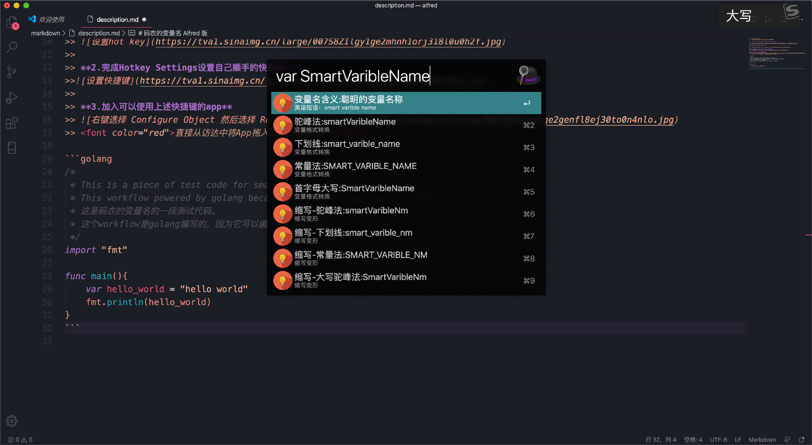
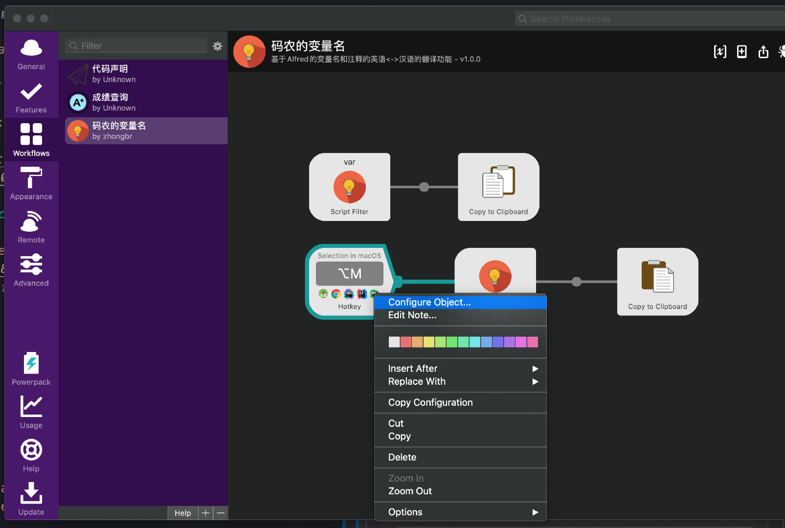
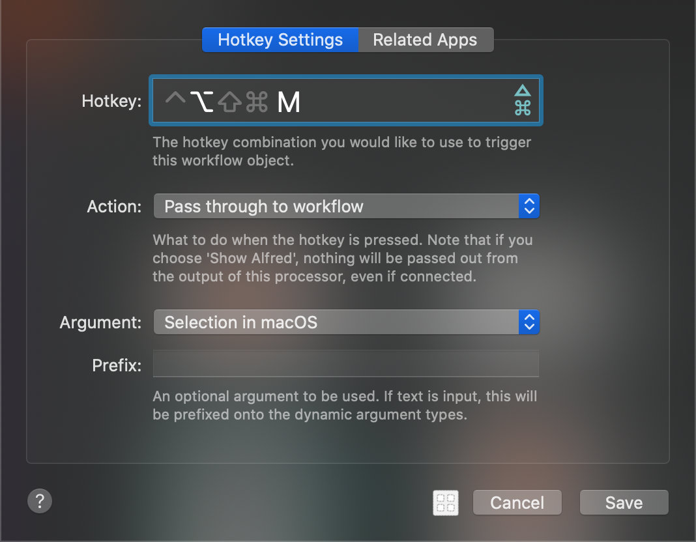
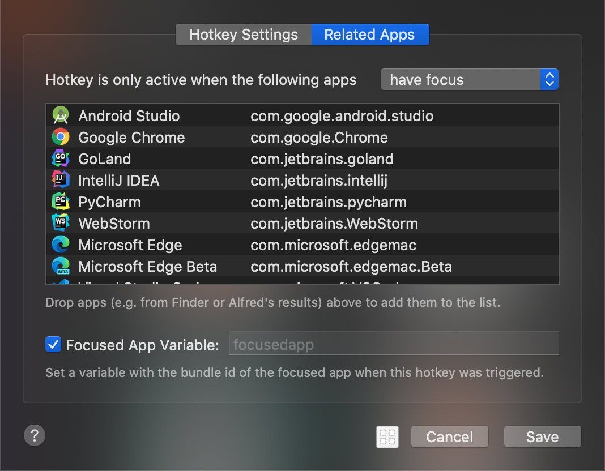

# 码农的变量名 Alfred 版

## 效果演示



## 简要的教程
基于Alfred实现的可以运行在macos上的 码农的变量名

**链接：https://share.weiyun.com/5L3cycL 密码：cad5rt**
>
将本Workflow安装到Alfred后，按下面的步骤完成设置，就可以在敲代码的时候直接使用快捷键触发Workflow。

**1.右键选择 Configure Object**




**2.完成Hotkey Settings设置自己顺手的快捷键**



**3.加入可以使用上述快捷键的app**


<font color="red">直接从访达中将App拖入此窗口中即可。</font>

```golang
/*
 * This is a piece of test code for smart var workflow .
 * This workflow powered by golang because it can be compiled to binary .
 * 这是码农的变量名的一段测试代码。
 * 这个workflow是golang编写的，因为它可以编译成二进制文件。
 */
import "fmt"

func main(){
    var hello_world = "hello world"
    fmt.println(hello_world)
}
```
